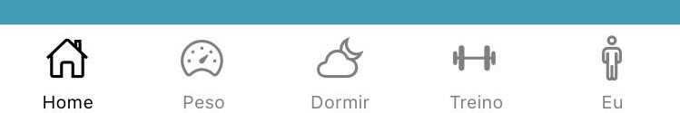
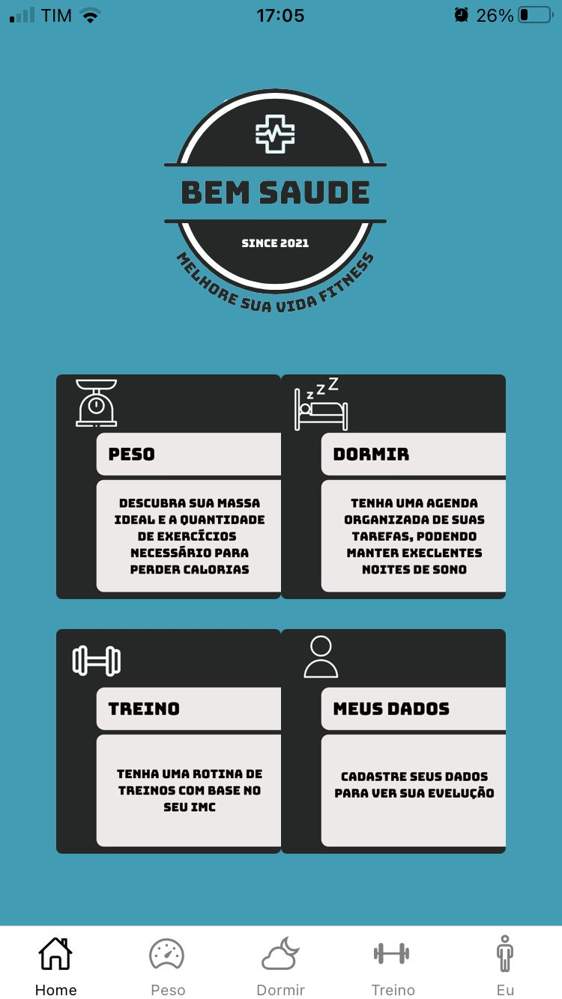
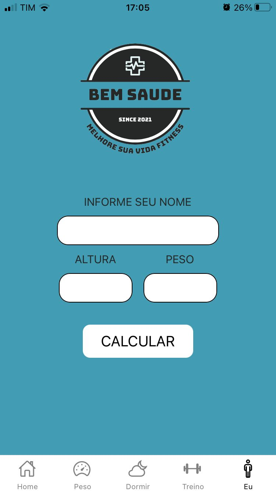
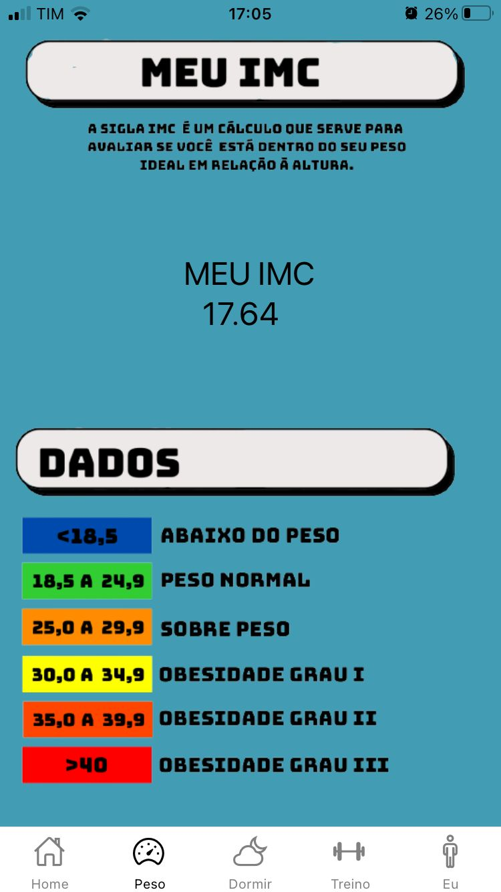
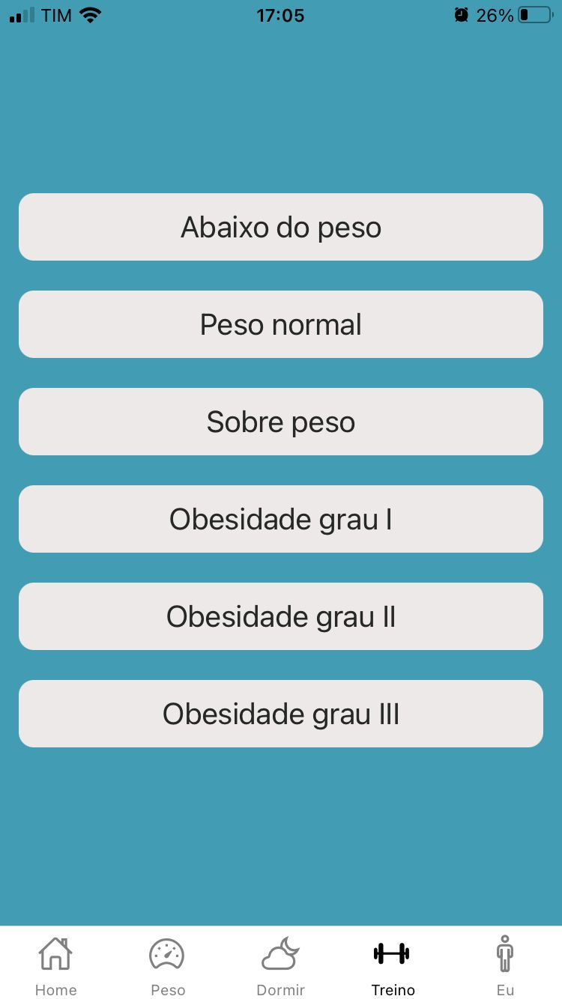
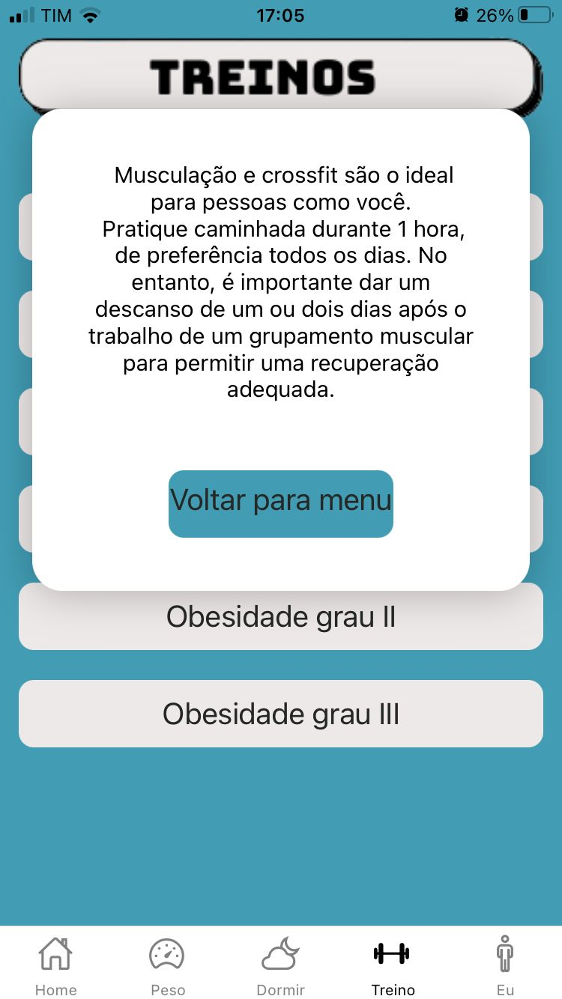
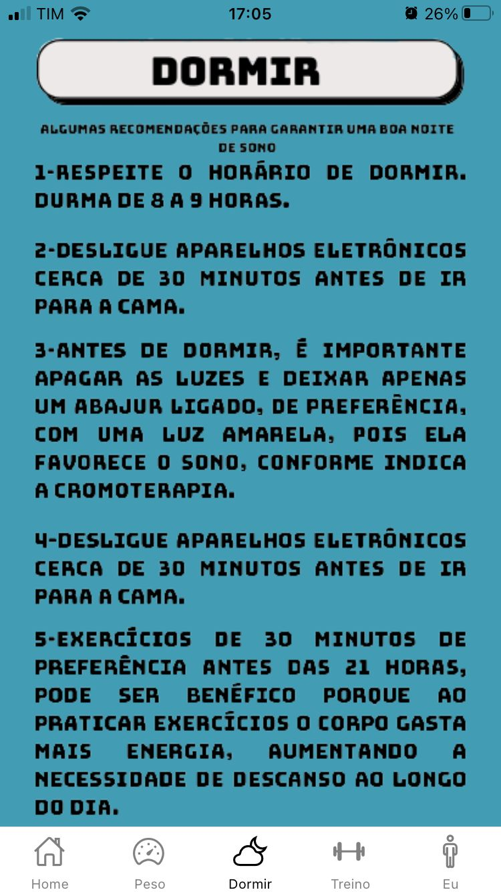

<html><head>

<h2><b>
Bem Saúde </b></h3>

<h3><b>
SOBRE O PROJETO </b></h3>
Bem saúde se trata de um aplicativo de cálculo de IMC(Índice de massa corporal), desenvolvido na disciplina de Soluções Mobile na 3ª fase do curso técnico de informática SATC.

 

<h3><b>
OBJETIVO </b></h3>
O App tem por objetivo calcular o IMC do usuário, e com base no resultado, indicar algumas opções de treino como caminhadas e exercícios. Como o aplicativo é apenas um "Protótipo", não devem ser levadas em consideração as atuais opções de treino, pois não foram estudadas a fundo e servem apenas como base para o funcionamento do App. Caso fosse encaminhado para utilização, ambas as partes teriam que ser repaginadas para ocasionar em uma boa experiência. 

 
 

<h3><b>
NAVEGAÇÃO ENTRE TELAS </b></h3>
A navegação entre telas é feita através do Tab Navigation, o qual facilita a utilização e experiência do usuário. Faz com que a navegação fique mais intuitiva e mais prática, facilitando pessoas com dificuldades na utilização.

  

<h3><b>
HOME </b></h3>
Home simples com 4 cards contendo breves resumos sobre cada tela do App. Cada card possui sua própria navegação para a tela desejada.

  
<h3><b>
INSERIR DADOS </b></h3>
Nessa página, o usuário irá inserir seus dados para que o App faça o seu cálculo de IMC.

  

<h3><b>
SEU IMC </b></h3>
Nesta tela será mostrado o resultado do seu IMC, que é feito através de um cálculo matemático. Depois de ter seu resultado, basta analisar na tabela abaixo em qual padrão você se encontra.

  

<h3><b>
TREINOS </b></h3>
Esta tela é composta por modais e com base no resultado do seu imc, pode-se visualizar o padrão obtido e então seguir as dicas pré-selecionadas pelo App .

                  

  
<h3><b>
DORMIR </b></h3>
Uma página adicional contendo dicas para ter uma boa noite de sono.

<h3><b>
FERRAMENTAS
</b></h3>
O projeto foi desenvolvido na plataforma Expo Snack(permite criar apps por um editor na WEB) e para seu desenvolvimento foi utilizado o framework React Native que usa como linguagem JavaScript.

<h3><b>
DESENVOLVEDORES </b></h3>

 

&#x1F920; Olá, eu sou o Victor. 

 <b>Um pouco mais sobre mim... </b><i>(Aperta aí)</i> 

&#x1F4BB;Cursando Informática no Colégio Satc   
&#x1F4BB;Aluno do 3° ano E.M do Colégio Satc  
&#x1F575;Futuro estagiário  
&#x1F5FA;Cocal do Sul-SC	

 

&#x1F4F2;Me siga no [instagram](https://www.instagram.com/victor__bonomi/?hl=pt-br)!
 

  

&#x1F920; Olá, eu sou o Vinicius. 

 <b>Um pouco mais sobre mim... </b><i>(Aperta aí)</i> 

&#x1F4BB;Cursando Informática no Colégio Satc   
&#x1F4BB;Aluno do 3° ano E.M do Colégio Satc  
&#x1F575;Futuro estagiário  
&#x1F5FA;Criciúma-SC	

 

&#x1F4F2;Me siga no [instagram](https://www.instagram.com/vinidamiani_/?hl=pt-br)!
 

 

&#x1F4D6;<i>"15 anos a trás, a internet era uma maneira de fugir do mundo real, hoje o mundo real é uma maneira de fugir da internet".  
by: John </i> 

 

</body></html>